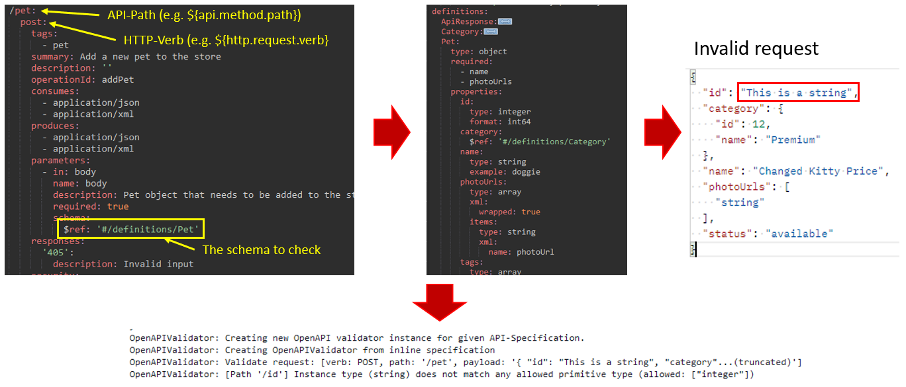

# OpenAPI Validator for Axway API-Management

This project provides a library that you can use to check the request or response against the API specification imported into the API Manager or an external API specification. Based on the API path, HTTP verb, and headers, the correct model is loaded from the API specification and used for verification.  
The following illustrates how it works and behaves in the API-Gateway at runtime:  

[

## Installation

To install, download the release package and install it under `ext/lib`. After that, restart the API Gateway. It is recommended to make the jar files known in the Policy Studio as well.

## Setup

To call the OpenAPI validator, use a scripting filter. You can use Groovy or any other supported language here. You can use it to validate requests and responses.  

### Validate request

Here is an example for Groovy:

```groovy
import com.axway.openapi.validator.OpenAPIValidator;
import com.vordel.trace.Trace

def invoke(msg)
{
    def validator = OpenAPIValidator.getInstance(apiId, "apiadmin", "changeme");
    def payload = bodyAsString(msg.get("content.body"));
    def path = msg.get("api.method.path");
    def verb = msg.get("http.request.verb");
    def queryParams = msg.get("params.query");
    def headers = msg.get("http.headers");
    Trace.debug('Calling OpenAPIValidator: [path: ' + path + ', verb: ' + verb + ']');
    try {
        def rc = validator.isValidRequest(payload, verb, path, queryParams, headers);
        return rc;
    } catch (Exception e) {
        Trace.error('Error validating request', e);
        return false;
    }
}

def bodyAsString(body) {
    if (body == null) {
        return null
     }
     try {
         return body.getInputStream(0).text
     } catch (IOException e) {
         Trace.error('Error while converting ' + body.getClass().getCanonicalName() + ' to java.lang.String.', e)
         return null
     }
}
```

### Validate response

```groovy
import com.axway.openapi.validator.OpenAPIValidator;
import com.vordel.trace.Trace

def invoke(msg)
{
    // Read OpenAPI-Spec from an attribute
    // String swagger = msg.get('var.swagger')
    // def validator = OpenAPIValidator.getInstance(swagger);
    def validator = OpenAPIValidator.getInstance(apiId, "apiadmin", "changeme");
    def payload = bodyAsString(msg.get('content.body'));
    def path = msg.get("api.method.path");
    def verb = msg.get("http.request.verb");
    def status = msg.get("http.response.status");
    def headers = msg.get("http.headers");
    Trace.debug('Calling OpenAPIValidator: [path: ' + path + ', verb: ' + verb + ', status: ' + status + ']');
    try {
        def rc = validator.isValidRequest(payload, verb, path, status, headers);
        return rc;
    } catch (Exception e) {
        Trace.error('Error validating response', e);
        return false;
    }
}

def bodyAsString(body) {
    if (body == null) {
        return null
     }
     try {
         return body.getInputStream(0).text
     } catch (IOException e) {
         Trace.error('Error while converting ' + body.getClass().getCanonicalName() + ' to java.lang.String.', e)
         return null
     }
}
```
