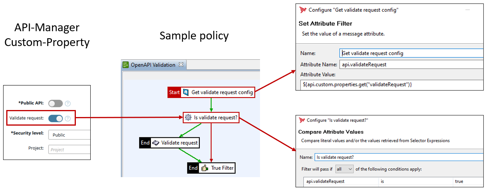

# OpenAPI Validator for Axway API-Management

This project provides a library that you can use to check the request or response against the API specification imported into the API Manager or an external API specification. Based on the API path, HTTP verb, and headers, the correct model is loaded from the API specification and used for verification.  
The following illustrates how it works and behaves in the API-Gateway at runtime:  


## Installation

To install, download the [release package](https://github.com/Axway-API-Management-Plus/openapi-validator/releases) and install it under `ext/lib`. After that, restart the API Gateway. It is recommended to make the jars files known in the Policy Studio as well as it is describe here: https://docs.axway.com/bundle/axway-open-docs/page/docs/apim_policydev/apigw_poldev/general_ps_settings/index.html#runtime-dependencies

## Setup

To call the OpenAPI validator, use a scripting filter. You can use Groovy or any other supported language here. You can use it to validate requests and responses.  

### Validate request

Use a request policy and, for example, a custom property to enable or disable the check. The validator can be included using a scripting filter as in the following example.  

  

Here is an example for Groovy:  

```groovy
import com.axway.apim.openapi.validator.OpenAPIValidator;
import com.vordel.trace.Trace

def invoke(msg)
{
    // Get the ID of the API currently processed
    def apiId = msg.get("api.id");
    // Get/Create an OpenAPIValidator instance based on the API-ID
    def validator = OpenAPIValidator.getInstance(apiId, "apiadmin", "changeme");
    // Get required parameters for the validation
    def payload = bodyAsString(msg.get('content.body'));
    def path = msg.get("api.method.path");
    def verb = msg.get("http.request.verb");
    def queryParams = msg.get("params.query");
    def headers = msg.get("http.headers");
    try {
        // Call the validator itself
        def rc = validator.isValidRequest(payload, verb, path, queryParams, headers);
        Trace.info('rc: ' + rc);
        return rc;
    } catch (Exception e) {
        Trace.error('Error validating request', e);
        return false;
    }
}

def bodyAsString(body) {
    if (body == null) {
        return null
     }
     try {
         return body.getInputStream(0).text
     } catch (IOException e) {
         Trace.error('Error while converting ' + body.getClass().getCanonicalName() + ' to java.lang.String.', e)
         return null
     }
}
```

### Validate response

Analogously, you can also check the response. Since the response scheme depends on the status code, this must also be passed.

```groovy
import com.axway.apim.openapi.validator.OpenAPIValidator;
import com.vordel.trace.Trace

def invoke(msg)
{
    def apiId = msg.get("api.id");
    def validator = OpenAPIValidator.getInstance(apiId, "apiadmin", "changeme");
    def payload = bodyAsString(msg.get('content.body'));
    def path = msg.get("api.method.path");
    def verb = msg.get("http.request.verb");
    def status = msg.get("http.response.status");
    def headers = msg.get("http.headers");
    Trace.debug('Calling OpenAPIValidator: [path: ' + path + ', verb: ' + verb + ', status: ' + status + ']');
    try {
        def rc = validator.isValidResponse(payload, verb, path, status, headers);
        return rc;
    } catch (Exception e) {
        Trace.error('Error validating response', e);
        return false;
    }
}

def bodyAsString(body) {
    if (body == null) {
        return null
     }
     try {
         return body.getInputStream(0).text
     } catch (IOException e) {
         Trace.error('Error while converting ' + body.getClass().getCanonicalName() + ' to java.lang.String.', e)
         return null
     }
}
```

## Get an OpenAPI-Validator instance

The OpenAPI validator can be created in several ways. It is implemented as a singleton. This means that only one instance exists per API specification/API ID. Basically, the validator is instantiated based on a Swagger 2.0 or OpenAPI 3.0.x specification. You can provide it in JSON or YAML format.

### Based on the API-Manager API-ID

With this option, you pass the ID of the API in the API Manager. The OpenAPI validator uses the credentials to load the associated API specification (Swagger 2.0, OpenAPI 3.0) and initialize itself with it. This process is done only on the first call for each API-ID. 
The user must be User, which has access to this API. The user must be a member of an organization that can see this API.
You can also specify the URL of the API manager, otherwise `https://localhost:8075` is taken as default.

```
OpenAPIValidator.getInstance(apiId, "apiadmin", "changeme");
// or
OpenAPIValidator.getInstance(apiId, "user", "password", "https://manager.customer.com");
```

### Using an Inline Swagger

With this procedure, you pass the API specification as a string to the OpenAPI validator. You can read this from the KPS via policies, for example. In this case, a hash value is determined for the API specification and an OpenAPI Validator instance is created for each hash value.

```
def swagger = msg.get("swaggerAsString");
def validator = OpenAPIValidator.getInstance(swagger);
```

### Using a URL

With this option you specify the URL that the API specification returns. For example: https://petstore.swagger.io/v2/swagger.json. Authentication is not currently supported. Please create an issue if this is necessary.

```
def validator = OpenAPIValidator.getInstance("https://petstore.swagger.io/v2/swagger.json");
```


## API Management Version Compatibilty

This artefact has been tested with API-Management Versions

| Version            | Comment         |
| :---               | :---            |
| 7.7-20210830       |                 |
| 7.7-20210530       |                 |
| 7.7-20210330       |                 |
| 7.7-20200930       |                 |

Please let us know, if you encounter any [issues](https://github.com/Axway-API-Management-Plus/openapi-validator/issues) with your API-Manager version.  

## Contributing

Please read [Contributing.md](https://github.com/Axway-API-Management-Plus/Common/blob/master/Contributing.md) for details on our code of conduct, and the process for submitting pull requests to us.

## Team

![alt text][Axwaylogo] Axway Team

[Axwaylogo]: https://github.com/Axway-API-Management/Common/blob/master/img/AxwayLogoSmall.png  "Axway logo"


## License
[Apache License 2.0](/LICENSE)
